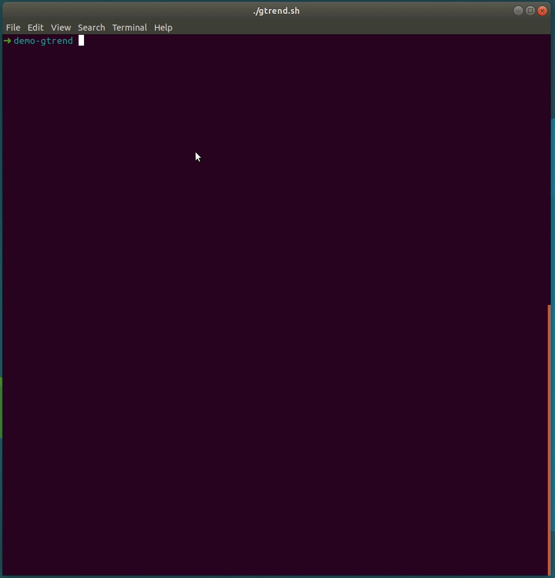

# gTrend

gTrend fetch GitHub trending repositories and display them into your terminal.

Using <kbd>↑</kbd> and <kbd>↓</kbd> you can select a repository and open it in
your browser by pressing <kbd>ENTER</kbd>.




# Installation

`npm i gtrend -g`


# Usage

  * `gtrend [options]`

## Options
```
  -h, --help              Display this usage guide.                             
  -n, --num number        Number of items to display, default to 10.            
  -t, --timespan string   Time span of repositories [ 'daily', 'weekly',        
                          'monthly' ], default to daily.                        
  -s, --sort string       Sort repositories [ 'starstoday', 'stars', 'forks' ],
                          default to starstoday.                                
  -l, --language string   Specify a language, e.g. JavaScript, default to all.  
  -b, --browser string    Specify a browser, e.g. firefox or google-chrome.
  --nocache               (re)Load repo from GitHub, renewing cache.
```

## Examples

| Command                | Description                             |
| ---------------------- | --------------------------------------- |
| `gtrend -n 15`         | Displays 15 daily trending repos        |
| `gtrend -t monthly`    | Displays monthly trending repos         |
| `gtrend -s forks`      | Displays trending repos sorted by forks |
| `gtrend -l JavaScript` | Displays JavaScript trending repos      |
| `gtrend -b firefox`    | Open repo in firefox                    |

So, if you want to display 20 weekly trending repos sorted by stars and want to use google-chrome:

`gtrend -n 20 -t weekly -s stars -b google-chrome`

The command default are:

`gtrend -n 10 -t daily -s starstoday` which is equivalent to `gtrend`.


# TODOS

  - [x] Add cli opt (daily, weekly, number of items, etc...)
  - [x] Implementation of `strip-ansi` in order to display line highlighting  
        correctly (https://github.com/cronvel/terminal-kit/issues/68)
  - [x] Add some local cache
  - [x] Sort repository by number of stars / forks
  - [x] Better man page
  - [ ] Run some tests
  - [ ] `-v`, `--version` args opt
  - [ ] Makefile + version management


# LOGS

  * v0.1.0  Thanks to [@cronvel](https://github.com/cronvel/terminal-kit/issues/68) highlighting of selected line is now perfect !
  * v0.0.7  WIP Makefile
  * v0.0.6  Tuning
  * v0.0.5  Quick fixes, `--nocache` option
  * v0.0.4  Cache, better README
  * v0.0.3  CLI args (sorting, language, timespan, etc...) are now ok
  * v0.0.2  Basic but functional version
  * v0.0.1  Basic tests with different libraries
